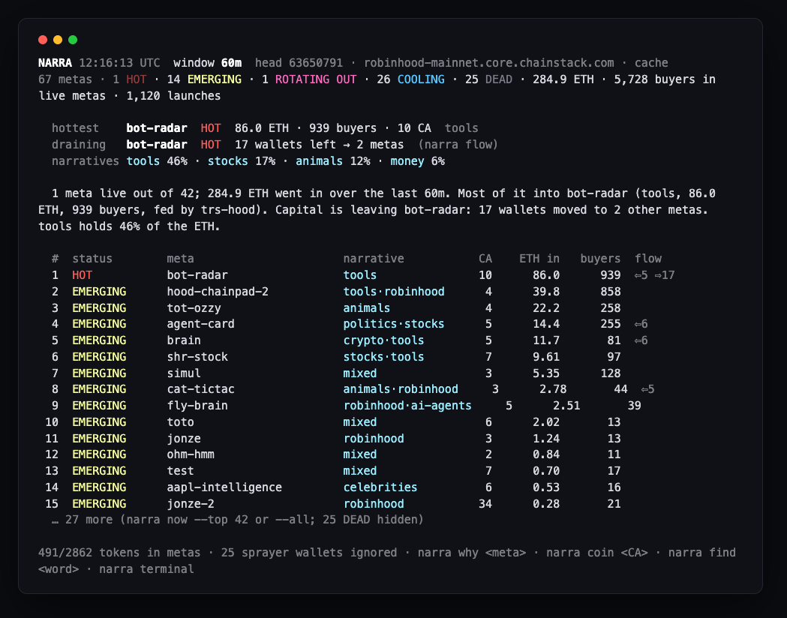
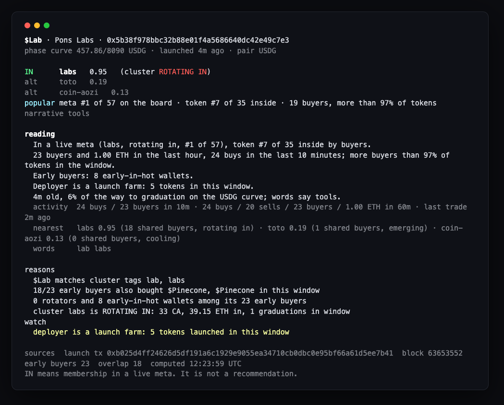
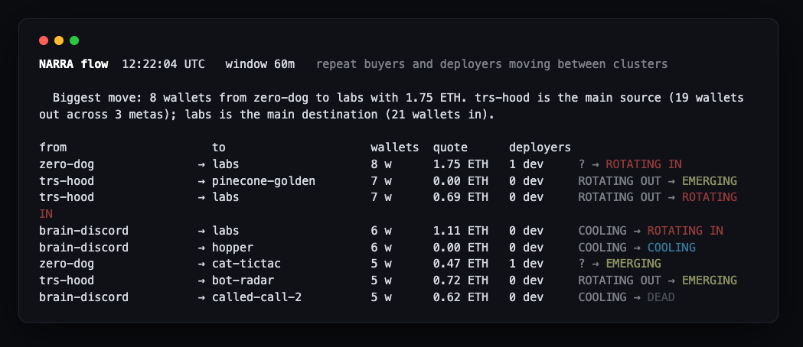
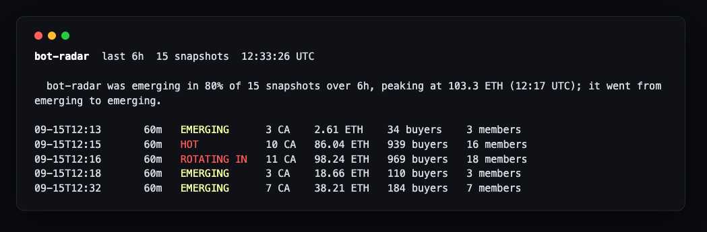

<div align="center">

# narra

**Which meta is printing on Pons v2 / Robinhood Chain right now, and is this token in it?**

A read-only terminal for the memecoin launchpad: it groups thousands of launches an hour into metas, follows the wallets from one meta to the next, and answers `IN` or `OUT` for any contract address with the buyers behind the answer.

[](https://www.npmjs.com/package/narrahood)
[](#install)
[](./LICENSE)
[](https://narrahood.com)



</div>

```sh
npm i -g narrahood && narra now
```

No key, no wallet, no config. The first run reads the last hour of the chain into `~/.narra/narra.db` (about two minutes on the public RPC); every command after that takes seconds.

## What it answers

**Which meta is printing.** `narra now` ranks every meta in the window: status, launches, ETH in, buyers, and the flow of repeat buyers in and out. The reading at the top is a sentence built from the numbers, never from a model.

**Is this token in it.** `narra coin <CA>` answers `IN`, `EDGE`, `OUT` or `ORPHAN` and shows why: which meta, how many of the token's early buyers also bought the meta's other tokens, how many are snipers, rotators or bots, and where those buyers went next.

<div align="center"></div>

**Where the money moved.** `narra flow` counts wallets that bought two tokens of meta A in the previous window and one token of meta B in this one. Every arrow is a list of transactions.

<div align="center"></div>

**How a meta rose and faded.** `narra history <meta>` replays its statuses tick by tick; `narra history flow` samples the rotation per hour; `narra trend` splits two days of ETH by narrative.

<div align="center"></div>

`IN` means the token belongs to a live meta. It is not a recommendation, and metas die faster than clusters update.

## The terminal

```sh
narra terminal          # full screen; q quits
```

Left: the board, ranked. Right: the selected meta — numbers, what holds it together, wallet clusters, flow in and out, members. Bottom: the live feed of launches, status changes and rotations. Press `c`, paste a contract address, and the card replaces the board. `↑↓` move · `enter` open · `f` flow · `W` wallets · `w` window · `?` help.

## Install

Node 22 or newer.

```sh
npx narrahood now                 # no install
npm i -g narrahood && narra now   # global
git clone https://github.com/Bonsaixbt/narra && cd narra && npm i && npm run now
```

`--window 15m` for a faster first look. A private RPC makes everything faster; see [Your own RPC](#your-own-rpc).

## Commands

| Command | Answers | Exit code |
|---|---|---|
| `narra now [--window 15m\|60m\|4h] [--top 15\|--all] [--pair eth\|stable\|stock] [--members]` | the answer first (hottest meta, where capital drains, narrative shares), then the top metas; DEAD hidden unless `--all` | 0 |
| `narra find <word\|ticker\|0xprefix>` | search metas and tokens in the window by any word | 0 / 3 |
| `narra coin <CA…>` | IN / EDGE / OUT / ORPHAN / NOT_PONS for a token, with reasons | `--quiet`: 0 IN · 1 EDGE · 2 OUT · 3 ORPHAN · 4 NOT_PONS |
| `narra flow` | which wallets and deployers moved from meta A to meta B | 0 |
| `narra why <meta>` | why a meta is named and grouped that way, members, links; takes the slug or any word from its name, tags or tickers | 0 (3 if nothing matches) |
| `narra wallets [--cohort sniper\|sprayer\|rotator\|early-in-hot] [--sort net_eth]` | which wallets carry capital between metas, with wallet cluster labels | 0 |
| `narra wallet <0x…>` | one wallet: wallet clusters, positions, entry delay after launch, ETH in/out | 0 |
| `narra history <slug\|0x…> [--hours 24] [--window 60m]` | status timeline of a meta, or hourly activity of a token | 0 / 3 |
| `narra history flow [--hours 24] [--step 1h] [--window 60m]` | flow edges sampled per step from the cache (one tick per step) | 0 |
| `narra watch [--every 15] [--only STATUS,EDGE]` | live feed: LAUNCH, STATUS, EDGE, GRAD, JOIN | runs until ctrl-c |
| `narra doctor` | RPC, chain id, live Pons parameters vs expectations, cache | 0 / 11 |
| `narra serve [--port 4663]` | the same answers as JSON over local HTTP + SSE | runs |
| `narra mcp` | MCP server over stdio for Claude, Cursor, Codex and friends | runs |
| `narra schema [now\|coin\|flow\|why\|watch\|…]` | JSON Schema of every output | 0 |
| `narra trend [--hours 48] [--step 4]` | ETH per step split by narrative over the collected history | 0 |
| `narra calibrate [--window 60m] [--hours 168] [--write]` | propose status thresholds from the snapshots the cache collected | 0 / 3 |
| `narra backfill --hours 24` · `narra cache [path\|stats\|clear]` | deep backfill (older rows fold into hourly aggregates) · maintenance | 0 |

Every command takes `--json` (streams take `--jsonl`), `--rpc <url,url#nologs>`, `--db <path>`, `--no-color`, `--offline` (analyse the cache without syncing). Addresses can come from stdin: `echo 0x… | narra coin`.

## For agents

**MCP.** One line in the MCP config of Claude Desktop, Claude Code, Cursor, Windsurf or Codex:

```json
{ "mcpServers": { "narra": { "command": "npx", "args": ["-y", "narrahood", "mcp"] } } }
```

```sh
claude mcp add narra -- npx -y narrahood mcp
```

Tools: `narra_now`, `narra_coin`, `narra_flow`, `narra_why`, `narra_doctor`. A prompt `narra_check_before_entry` tells the model to call `narra_coin` first, quote the reasons and never encourage entries.

**JSON.** Every answer carries `schema_version`, `computed_at`, `window`, `head_block`, `lag_blocks` and `source`. Fields never disappear within a major version. `narra schema coin` prints the JSON Schema; all of them are in [`schemas/`](./schemas).

```sh
narra coin 0x… --json | jq '{verdict, cluster, reasons}'
narra now --json | jq -r '.clusters[] | select(.status=="HOT") | .slug'
narra watch --jsonl --only STATUS | jq -r 'select(.to=="HOT") | .slug'
narra coin 0x… --quiet && echo "in a live meta"
```

**HTTP.** `narra serve` binds `127.0.0.1:4663`: `/now`, `/coin/:ca`, `/flow`, `/why/:slug`, `/stream` (SSE), `/schema/:name`, `/health`. For n8n, Make, Telegram bots, anything with an HTTP node.

**Library.**

```ts
import { createNarra } from "narrahood";
const narra = createNarra();            // public RPCs, ~/.narra/narra.db
const board = await narra.now();         // same object as `narra now --json`
const card  = await narra.coin("0x…");
narra.close();
```

Pure functions (`tokenize`, `buildClusters`, `statusOf`, `flowEdges`, `verdictFor`) are exported without any network dependency. Ready-made files for Claude Code skills, Cursor rules, `AGENTS.md`, OpenAI function calling, LangChain and shell pipelines live in [`integrations/`](./integrations).

## Hosted

The same engine runs at [narrahood.com](https://narrahood.com): the board, the card, flow with history, wallet clusters, share cards for X. The service behind it is in [`service/`](./service) with its routes in [`service/README.md`](./service/README.md). A Telegram bot, [@xnarra_bot](https://t.me/xnarra_bot), answers `/coin`, `/meta`, `/why`, `/find`, `/flow` and `/trend` from the same analyses. The hosted version adds history and convenience, never data the terminal cannot compute itself.

## How it decides

- **Tags.** Name, ticker and the first sentence of the description become weighted tags through an open dictionary (`src/analyze/dictionary.json`): stop words, aliases (`robinhood → hood`, `tesla → tsla`), compound tickers split on known seeds (`HOODRAT → hood + rat`), CJK words mapped to the English tag they share a meta with.
- **Clusters.** Two tokens are linked when the weighted Jaccard of their tags is ≥ 0.35, when they share a deployer and a tag (unless that deployer is a launch farm), or when they share ≥ 5 buyers and ≥ 20 % of the smaller buyer set. Sprayers — wallets buying more than the window's cap of distinct tokens — do not vote. Connected components of three or more tokens are metas; a component above 60 is re-clustered with stricter thresholds.
- **Heat.** Per window: launches, members alive (a buy in the last 15 minutes), ETH into curves and pools, unique buyers, graduations, share of members already in a Uniswap v4 pool, share of buys that paid the opening tax, change against the previous window.
- **Status.** Calibrated on a week of snapshots (2026-09-14): `HOT` ≥ 9 launches and ≥ 20 ETH in the hour (the top decile of inflow) · `EMERGING` fewer launches but ≥ +100 % and ≥ 38 buyers · `ROTATING IN/OUT` ≥ 8 repeat wallets arriving / leaving · `COOLING` little money, falling · `DEAD` nothing alive. Thresholds live in `src/analyze/thresholds.json` and are re-fit as data grows.
- **Flow.** A wallet "sat in" meta A if it bought two different A tokens in the previous window; the edge A→B counts those wallets buying B in this window, plus deployers that switched. Every edge carries the buys behind it.
- **Verdict.** membership = ½ text similarity to the meta + ½ share of the token's early buyers seen in other members. `IN` needs ≥ 0.5 and at least two overlapping buyers in a live meta; `EDGE` is a name that fits without the capital; `OUT` is a cooling meta or a crowd already leaving; `ORPHAN` shares neither words nor wallets.
- **Identity.** A meta keeps its id (`slug@first_seen`) while it shares members with the previous tick, so history follows the meta and not the name.

Full description with formulas: [docs/STRATEGY.md](./docs/STRATEGY.md). What is read from the chain and how: [docs/PONS.md](./docs/PONS.md). What the tool does not do: [docs/SAFETY.md](./docs/SAFETY.md).

## Semantic layer (optional)

Off by default; the deterministic core never depends on it. `NARRA_SEMANTIC=on` adds two things:

- **Embeddings → semantic links.** Every token's name, ticker and first description sentence are embedded once locally (`Xenova/multilingual-e5-small`, cached in SQLite). Two tokens link when their vectors are close in three senses at once. Nine taxonomy buckets (animal, stock, ai-agent, politics, chinese-culture, crypto-meta, tool, celebrity, finance) are embedded as anchor phrases and a token gets `cat:<bucket>` as a tag when it sits clearly closest to one; those categories vote in the narrative next to the dictionary.
- **Meta naming.** `NARRA_SEMANTIC_NAME=openai|anthropic` asks a chat model for a label and a one-line summary per live meta (once per meta id, capped by `NARRA_SEMANTIC_BUDGET_PER_DAY`). Any OpenAI-compatible endpoint works, including OpenRouter's free models.

`--no-semantic` produces the same numbers without semantic links; `narra why` shows how many links of each kind hold a meta, `narra doctor` shows the provider and the embedding cache.

## History

`narra backfill --hours 48` on a private node fills two days in a few minutes; rows older than the retention fold into hourly aggregates, so `narra trend` and `narra history` keep working over weeks while the raw table stays bounded.

```
$ narra trend --hours 48 --step 4
from (UTC)   launches  buys    ETH in             mixed      chinese    robinhood  stocks     animals    ai-agents
09-11 14:51  4479      119536   2904.1 ██████     55%        ·          12%        8%         5%         7%
…
09-13 06:51  3477      120905   3238.9 ███████    18%        65%        4%         3%         3%         1%
09-13 10:51  3569      154072   3754.3 ████████   34%        25%        11%        7%         7%         2%
```

Two days of nothing, then the Chinese narrative took two thirds of all ETH on the chain in one morning and started giving it back by noon. The board shows that live; the trend shows it in hindsight.

## Narratives

Every meta carries a narrative class next to its slug, decided by open rules in `dictionary.json`: **chinese** when at least half of the members have CJK names (with a sub-narrative from the tags, e.g. `chinese · animals`), otherwise the strongest tag family — animals, stocks, robinhood, ai-agents, politics, crypto, tools, celebrities, money, culture — when it covers a quarter of the members; **mixed** otherwise. `narra dictionary suggest` lists the words that carry the most ETH outside any family so the dictionary can grow.

## Wallets

Wallet clusters are arithmetic over the cache, recomputed every tick: **sniper** (≥ 3 buys, half of them within 5 s of launch), **sprayer** (more distinct tokens than the window's cap; they do not vote in clustering), **rotator** (bought in ≥ 3 metas, net ETH positive across them), **early-in-hot** (among the first buyers of a token that later sat in a HOT meta). They are labels, not a signal.

## After graduation

A meta does not end when its tokens leave the curve. narra indexes the Uniswap v4 pools Pons creates at graduation and every swap in them; pool buys count toward the meta's ETH and buyers, the card shows the phase, and a meta with most of its members in pools reads differently from one still on the curve.

## Your own RPC

Copy `.env.example` to `.env` (project) or `~/.narra/.env` (user) and put a private node first:

```
NARRA_RPC_URL=https://your-node/key,https://rpc.mainnet.chain.robinhood.com
NARRA_WS_URL=wss://your-node/ws/key
```

The file is gitignored and never leaves the machine. `narra doctor` shows which endpoints are in use. The gate learns each provider's `eth_getLogs` range cap and splits requests itself; a full tick costs about 18 RPC calls.

## Calibration

Every tick stores each meta's heat in `cluster_snapshots`. After days of `narra serve` or `narra watch`:

```sh
narra calibrate --window 60m --hours 168            # distribution + proposal
narra calibrate --window 60m --hours 168 --write    # store it with today's date
```

The proposal picks the HOT floor so that about 10 % of published metas qualify at any time (`--hot-share`) and prints its evidence; nothing changes until `--write`. To keep snapshots flowing, run `narra serve` as a service: `integrations/launchd/` (macOS) and `integrations/systemd/` (Linux).

## Tests

```sh
npm test        # 62 checks, no network: tokenizer, clustering, thresholds, flow, verdict, wallets, history, semantic (fake provider), log decoding and a full replay on recorded fixtures
npm run build   # tsc → dist
```

## What it is not

No private key. No `--live`. No buy button. No wallet connect. `IN` means the token belongs to a live meta. It is not a recommendation.

Roadmap: [docs/ROADMAP-PUBLIC.md](./docs/ROADMAP-PUBLIC.md). Changes: [CHANGELOG.md](./CHANGELOG.md). MIT.
